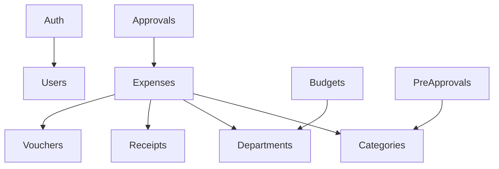

# TPL Expense - API Modules

## Module Index

| Module | Path | Status | Description |
|--------|------|--------|-------------|
| auth | `./auth/` | Complete | JWT authentication |
| users | `./users/` | Complete | User management |
| categories | `./categories/` | Complete | Expense categories (hierarchical) |
| departments | `./departments/` | Complete | Organizational units (hierarchical) |
| expenses | `./expenses/` | Placeholder | Core expense records |
| receipts | `./receipts/` | Placeholder | Receipt uploads & OCR |
| approvals | `./approvals/` | Placeholder | Approval workflow |
| vouchers | `./vouchers/` | Placeholder | Petty cash vouchers |
| budgets | `./budgets/` | Placeholder | Budget tracking |
| pre-approvals | `./pre-approvals/` | Placeholder | Pre-approval requests |

## Standard Module Structure
```
{module-name}/
├── {module-name}.module.ts      # NestJS module definition
├── {module-name}.controller.ts  # REST endpoints
├── {module-name}.service.ts     # Business logic
├── dto/
│   ├── create-{entity}.dto.ts   # Create validation
│   └── update-{entity}.dto.ts   # Update validation
└── index.ts                     # Barrel exports (optional)
```

## Creating a New Module

1. **Create folder structure**
```bash
mkdir -p src/modules/{name}/dto
```

2. **Use the template skill**
```bash
cat .claude/skills/api-module-template.md
```

3. **Register in app.module.ts**
```typescript
import { {Name}Module } from './modules/{name}/{name}.module';
// Add to imports array
```

## Common Patterns

### Service Injection
```typescript
constructor(private readonly prisma: PrismaService) {}
```

### Role-Based Access
```typescript
@UseGuards(JwtAuthGuard, RolesGuard)
@Roles(RoleType.ADMIN)
```

### Pagination
```typescript
const [items, total] = await Promise.all([
  this.prisma.entity.findMany({ skip, take, where }),
  this.prisma.entity.count({ where }),
]);
return { data: items, meta: { pagination: { page, pageSize, total, totalPages } } };
```

### Soft Delete
```typescript
async softDelete(id: string) {
  return this.prisma.entity.update({
    where: { id },
    data: { isActive: false },
  });
}
```

### Tree Structure (Categories/Departments)
```typescript
// Get all, then build tree in memory
const items = await this.prisma.entity.findMany({ include: { children: true } });
return this.buildTree(items);
```

## Cross-Module Dependencies



## Testing Pattern
```typescript
// {module}.service.spec.ts
describe('{Name}Service', () => {
  let service: {Name}Service;
  let prisma: PrismaService;

  beforeEach(async () => {
    const module = await Test.createTestingModule({
      providers: [{Name}Service, PrismaService],
    }).compile();
    service = module.get<{Name}Service>({Name}Service);
  });

  it('should create', async () => { ... });
});
```
